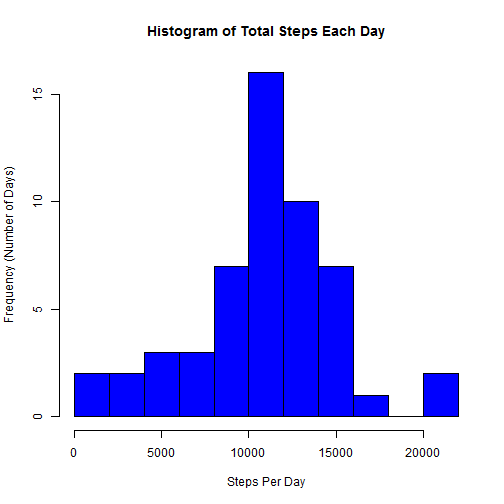

# Assignment 1 for Reproducible Research


## This assignment uses data collected from an activity monitoring device and can be found [on my github account] (https://github.com/georgemirandajr/RepData_PeerAssessment1/blob/master/activity.zip).

The variables included in this dataset are:


- steps: Number of steps taking in a five-minute interval (missing values are coded as 'NA')


- date: The date on which the measurement was taken in YYYY-MM-DD format


- interval: Identifier for the five-minute interval in which measurement was taken


The dataset is stored in a comma-separated-value (CSV) file format and contains a total of 17,568 observations.

## Loading and preprocessing the data 
First, you should download the data using the link above and save it to your working directory.

Once you have done this step, then you can load the data into R and name it something nice like I did below.


```r
activitydata <- read.csv("./activity.csv", header = TRUE)
```


## What is the mean total number of steps taken per day?

Suppose you want to know the mean total number of steps taken per day.  We can use the reshape2 package for that.


```r
library(reshape2)
```


You can use the melt() function in reshape2 to melt the dataframe by the number of steps in each day.


```r
activitymelt <- melt(activitydata, id = "date", measure.vars = "steps")
```


Then you will need to cast it into a shape that can give you a calculation of steps in each day.  We'll start by asking it to give us the sum for each day.


```r
activeSum <- dcast(activitymelt, date ~ variable, sum)
```


And then you can finally create a histogram to show the total number of steps taken each day.


```r
hist(activeSum$steps, main = "Histogram of Total Steps Each Day", xlab = "Steps Per Day", 
    ylab = "Frequency (Number of Days)", breaks = 10, col = "blue")
```

 


You can also get the **mean** and **median** of total number of steps taken per day.  We can set the na.rm argument to TRUE to ignore missing values.


```r
mean(activeSum$steps, na.rm = TRUE)
```

```
## [1] 10766
```

```r
median(activeSum$steps, na.rm = TRUE)
```

```
## [1] 10765
```


## What is the average daily activity pattern?
To see the average daily activity pattern you will need to melt the data by the 5-minute intervals.
Once that is done, you can plot these averages.


```r
intervalMelt <- melt(activitydata, id = "interval", measure.vars = "steps", 
    na.rm = TRUE)
intervalMean <- dcast(intervalMelt, interval ~ variable, mean)
plot(intervalMean$interval, intervalMean$steps, type = "l", main = "Average Steps Taken at Each Interval", 
    xlab = "5-Minute Interval", ylab = "Average Steps Per Day")
```

 


To find the 5-minute interval with the greatest average number of steps, you can use the following code:

```r
intervalMean[intervalMean$steps == max(intervalMean$steps), ]
```

```
##     interval steps
## 104      835   206
```


## Imputing missing values

To find the total number of missing values in the dataset, you can call the sum() and is.na() functions to find the number of "NA's" that appear in the "steps" variable.  There appears to be 2,304 missing values in the dataset.


```r
sum(is.na(activitydata$steps))
```

```
## [1] 2304
```


The average number of steps for the corresponding day will be used to replace the missing values (NA) and create a new dataframe without any missing values.


```r
newdataset <- activitydata
mean <- aggregate(newdataset[, 1], list(newdataset$date), mean, na.rm = TRUE)
for (i in 1:nrow(newdataset)) {
    if (is.na(newdataset[i, 1])) {
        newdataset[i, 1] <- mean[mean[, 1] == newdataset[i, 2], ][1, 2]
    }
}
for (i in 1:nrow(newdataset)) {
    if (is.na(newdataset[i, 1])) {
        newdataset[i, 1] <- 0
    }
}
```


The new, complete, dataframe can be used to create a new histogram.  


```r
newmelt <- melt(newdataset, id = "date", measure.vars = "steps")
```


Then you will need to cast it into a shape that can give you a calculation of steps in each day.  We'll start by asking it to give us the sum for each day.


```r
newSum <- dcast(newmelt, date ~ variable, sum)
```


And then you can finally create a histogram to show the total number of steps taken each day.


```r
hist(newSum$steps, main = "Histogram of Total Steps Each Day (no missing values)", 
    xlab = "Steps Per Day", ylab = "Frequency (Number of Days)", breaks = 10, 
    col = "orange")
```

 


You can now get the **mean** and **median** of total number of steps taken per day for this new dataset.


```r
mean(newSum$steps, na.rm = TRUE)
```

```
## [1] 9354
```

```r
median(newSum$steps, na.rm = TRUE)
```

```
## [1] 10395
```


As you can see, the mean and median decreased after replacing NA values with the mean values of steps per day.

## Are there differences in activity patterns between weekdays and weekends?

First, a logical vector can be created to indicate whether the first letter of the entry in the 'date' field (after the 'weekdays' function is applied) begins with the letter 'S'. If it begins with an 'S', we know that day is a weekend day. Otherwise, it is a weekday. Then we can assign the word 'weekend' or 'weekday' to a new column in 'newdataset'.  This new column will be a 'factor' variable with two levels.


```r
weekendLog <- grepl("^[Ss]", weekdays(as.Date(newdataset$date)))

for (i in (1:nrow(newdataset))) {
    if (weekendLog[i] == TRUE) {
        newdataset$day_of_week[i] <- "weekend"
    } else {
        newdataset$day_of_week[i] <- "weekday"
    }
}
```


To see the activity pattern differences between weekdays and weekends you will need to aggregate the data by the 5-minute intervals.
Once that is done, you can plot these averages by weekdays and weekends.


```r
meanInterval <- aggregate(newdataset$steps, by = list(newdataset$interval, newdataset$day_of_week), 
    FUN = "mean", na.rm = TRUE)
colnames(meanInterval) <- c("interval", "weekday_weekend", "avg_steps")


sort_order <- order(as.numeric(meanInterval$interval))
meanInterval <- meanInterval[sort_order, ]
```


Run the 'aggregate' function again to calculate the mean number of average steps (to two decimal
places) for both weekdays and weekends. The first row contains the info for weekdays and
the second for weekends.


```r
mean_by_day_type <- aggregate(newdataset$steps, by = list(newdataset$day_of_week), 
    FUN = "mean", na.rm = TRUE)
mean_weekdays <- round(mean_by_day_type[1, 2], 2)
mean_weekends <- round(mean_by_day_type[2, 2], 2)
```


Load the Lattice plotting system to plot the data.


```r
library(lattice)
```


And plot the data using Lattice.


```r
xyplot(avg_steps ~ as.numeric(interval) | as.factor(weekday_weekend), data = meanInterval, 
    type = "l", layout = c(1, 2), col = c("blue"), main = "Average Number of Steps by Interval (no missing values)", 
    xlab = "Five-minute interval", ylab = "Avg number of steps")
```


Based on the plot, it appears that there is, on average, more steps taken per interval on the weekend. Despite a higher peak of steps for a group of intervals under the weekday category, the average is consistently higher on weekends.
